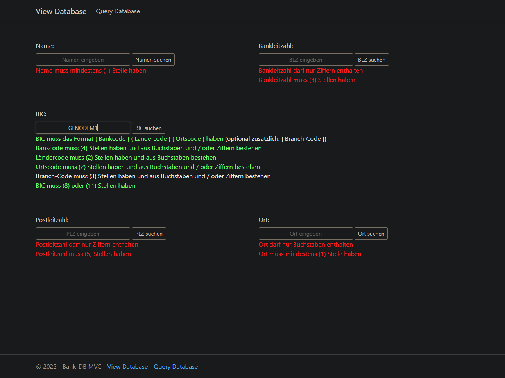

# How to use this repository

- set up [MSSQL Server](https://www.microsoft.com/en-us/sql-server) at `localhost:1433`; MSSQL login name: `SA`; MSSQL SA password: `P@ssw0rd`
- set up [Redis](https://redis.io/) at `localhost:6379`

   .. or ..

- use the included **Docker Compose** file (`docker-compose.yml`) to set up both of the above, using [Docker](https://www.docker.com/)

1. start up the `Bank_Database_MVC` project

## Docker Hub

The Bank Database container image is also available on [Docker Hub](https://hub.docker.com/r/seromaho/mssql_database_containers).

   Should you not want to use the included **Docker Compose** file (`docker-compose.yml`) to build the container image yourself, you may want to pull the database container image from **Docker Hub**:

- either run the following using **PowerShell** ..
```powershell
$containerName = "bank_db"
$imageName = "mssql_database_containers"
$namespace = "seromaho"
$hostPort = "1433"

# Pull the image from the Docker Hub registry
docker pull "${namespace}/${imageName}:${containerName}"

# Create a writeable container layer over the specified image
# Start the new container
docker run -e "ACCEPT_EULA=Y" -e "MSSQL_SA_PASSWORD=P@ssw0rd" -p "${hostPort}:1433" --name "${containerName}" -d "${namespace}/${imageName}:${containerName}"
```
- .. or run the following using **BASH**:
```bash
containerName="bank_db"
imageName="mssql_database_containers"
namespace="seromaho"
hostPort="1433"

# Pull the image from the Docker Hub registry
docker pull "${namespace}/${imageName}:${containerName}"

# Create a writeable container layer over the specified image
# Start the new container
docker run -e "ACCEPT_EULA=Y" -e "MSSQL_SA_PASSWORD=P@ssw0rd" -p "${hostPort}:1433" --name "${containerName}" -d "${namespace}/${imageName}:${containerName}"
```
- the image name is `seromaho/mssql_database_containers:bank_db`
- access the database at `localhost:1433`; MSSQL login name: `SA`; MSSQL SA password: `P@ssw0rd`

# Solution Features

- query a database of banking houses (located in Germany) in a web browser

   

- get input validation while you type

   

- get the query results from the database

   

- get the query results from a distributed cache

   
